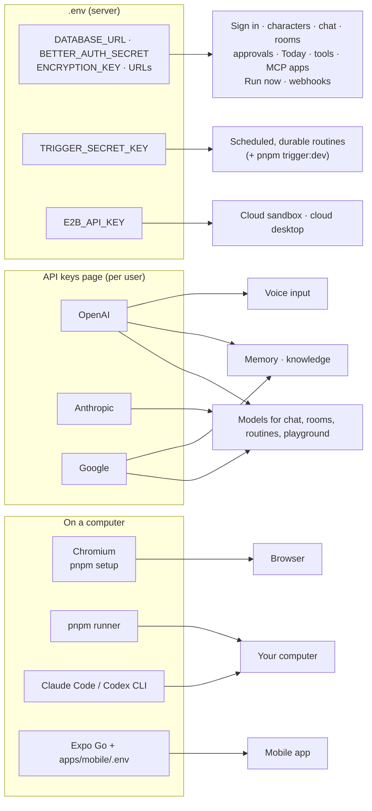

# Which key turns on what

```mermaid
flowchart LR
  subgraph env[".env (server)"]
    REQ["DATABASE_URL · BETTER_AUTH_SECRET<br/>ENCRYPTION_KEY · URLs"]
    TS["TRIGGER_SECRET_KEY"]
    EK["E2B_API_KEY"]
  end

  subgraph app["API keys page (per user)"]
    OAI["OpenAI"]
    ANT["Anthropic"]
    GOO["Google"]
  end

  subgraph local["On a computer"]
    CHR["Chromium<br/>pnpm setup"]
    RUN["pnpm runner"]
    CLI["Claude Code / Codex CLI"]
    EXP["Expo Go + apps/mobile/.env"]
  end

  REQ --> CORE["Sign in · characters · chat · rooms<br/>approvals · Today · tools · MCP apps<br/>Run now · webhooks"]
  OAI & ANT & GOO --> MODELS["Models for chat, rooms, routines, playground"]
  OAI --> EMB["Memory · knowledge"]
  GOO --> EMB
  OAI --> VOICE["Voice input"]
  TS --> SCHED["Scheduled, durable routines<br/>(+ pnpm trigger:dev)"]
  EK --> SBX["Cloud sandbox · cloud desktop"]
  CHR --> BRW["Browser"]
  RUN --> YOURS["Your computer"]
  CLI --> YOURS
  EXP --> PHONE["Mobile app"]
```

Everything in the middle column works with only the required `.env`
values and one AI key. Each optional piece adds one feature, and the app
says when one is missing.
