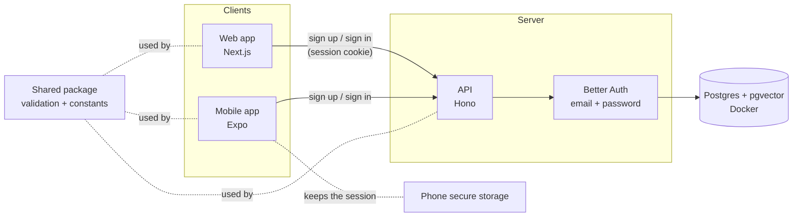

# Chapter 1 diagram

Both apps talk to one API, which owns sign-in. The shared package keeps
validation identical everywhere.

```mermaid
flowchart LR
  subgraph Clients
    W["Web app<br/>Next.js"]
    M["Mobile app<br/>Expo"]
  end

  subgraph Server
    A["API<br/>Hono"]
    BA["Better Auth<br/>email + password"]
  end

  S["Shared package<br/>validation + constants"]
  DB[("Postgres + pgvector<br/>Docker")]
  SS["Phone secure storage"]

  W -- "sign up / sign in<br/>(session cookie)" --> A
  M -- "sign up / sign in" --> A
  A --> BA --> DB
  M -. "keeps the session" .- SS
  S -. "used by" .- W
  S -. "used by" .- M
  S -. "used by" .- A
```
