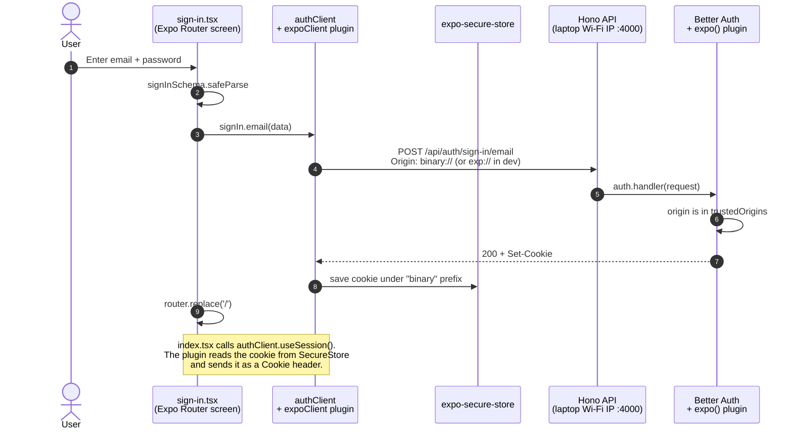
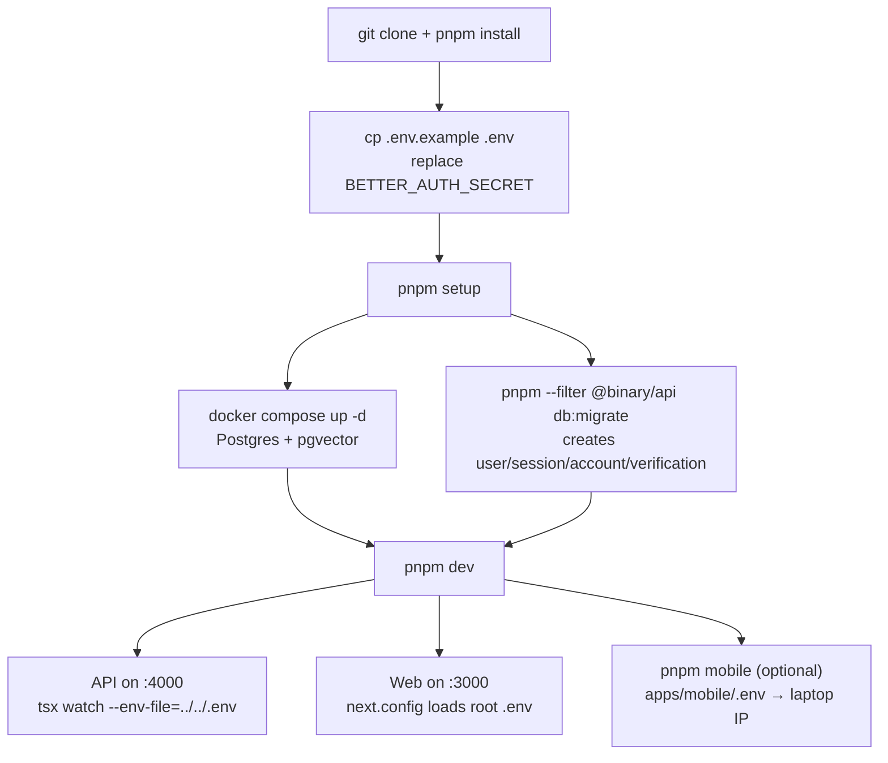

# Integration flow: mobile app and local setup

## Mobile sign-in with secure storage

```mermaid
sequenceDiagram
  autonumber
  actor U as User
  participant S as sign-in.tsx<br/>(Expo Router screen)
  participant AC as authClient<br/>+ expoClient plugin
  participant SS as expo-secure-store
  participant API as Hono API<br/>(laptop Wi-Fi IP :4000)
  participant BA as Better Auth<br/>+ expo() plugin

  U->>S: Enter email + password
  S->>S: signInSchema.safeParse
  S->>AC: signIn.email(data)
  AC->>API: POST /api/auth/sign-in/email<br/>Origin: binary:// (or exp:// in dev)
  API->>BA: auth.handler(request)
  BA->>BA: origin is in trustedOrigins
  BA-->>AC: 200 + Set-Cookie
  AC->>SS: save cookie under "binary" prefix
  S->>S: router.replace('/')
  Note over S,AC: index.tsx calls authClient.useSession().<br/>The plugin reads the cookie from SecureStore<br/>and sends it as a Cookie header.
```

## Local development setup

```mermaid
flowchart TD
  A["git clone + pnpm install"] --> B["cp .env.example .env<br/>replace BETTER_AUTH_SECRET"]
  B --> C["pnpm setup"]
  C --> C1["docker compose up -d<br/>Postgres + pgvector"]
  C --> C2["pnpm --filter @binary/api db:migrate<br/>creates user/session/account/verification"]
  C1 --> D["pnpm dev"]
  C2 --> D
  D --> D1["API on :4000<br/>tsx watch --env-file=../../.env"]
  D --> D2["Web on :3000<br/>next.config loads root .env"]
  D --> E["pnpm mobile (optional)<br/>apps/mobile/.env → laptop IP"]
```
