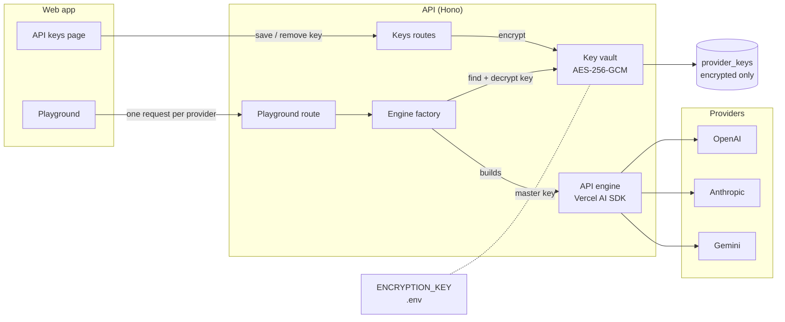

# Chapter 3 diagram

Follow a key from the API keys page into the database encrypted, and a prompt
from the Playground through the engine factory to each provider.

```mermaid
flowchart LR
  subgraph Web["Web app"]
    K["API keys page"]
    P["Playground"]
  end

  subgraph API["API (Hono)"]
    KR["Keys routes"]
    PR["Playground route"]
    V["Key vault<br/>AES-256-GCM"]
    F["Engine factory"]
    E["API engine<br/>Vercel AI SDK"]
  end

  MK["ENCRYPTION_KEY<br/>.env"]
  DB[("provider_keys<br/>encrypted only")]

  subgraph Providers
    O["OpenAI"]
    A["Anthropic"]
    G["Gemini"]
  end

  K -- "save / remove key" --> KR
  KR -- "encrypt" --> V --> DB
  MK -. "master key" .- V
  P -- "one request per provider" --> PR --> F
  F -- "find + decrypt key" --> V
  F -- "builds" --> E
  E --> O
  E --> A
  E --> G
```
