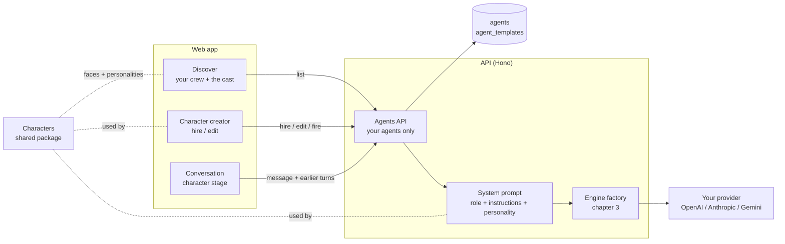

# Chapter 4 diagram

The new screens talk to one agents API. A reply turns the agent's profile and
personality into a system prompt, then reuses chapter 3's engine factory.

```mermaid
flowchart LR
  subgraph Web["Web app"]
    D["Discover<br/>your crew + the cast"]
    C["Character creator<br/>hire / edit"]
    T["Conversation<br/>character stage"]
  end

  CH["Characters<br/>shared package"]

  subgraph API["API (Hono)"]
    AR["Agents API<br/>your agents only"]
    SP["System prompt<br/>role + instructions + personality"]
    F["Engine factory<br/>chapter 3"]
  end

  DB[("agents<br/>agent_templates")]
  LLM["Your provider<br/>OpenAI / Anthropic / Gemini"]

  D -- "list" --> AR
  C -- "hire / edit / fire" --> AR
  AR --> DB
  T -- "message + earlier turns" --> AR
  AR --> SP --> F --> LLM
  CH -. "faces + personalities" .- D
  CH -. "used by" .- C
  CH -. "used by" .- SP
```
