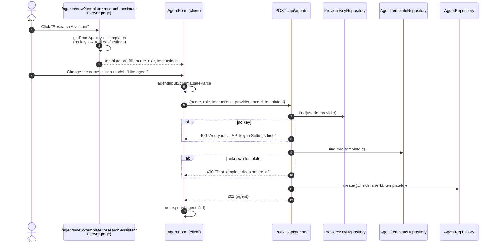
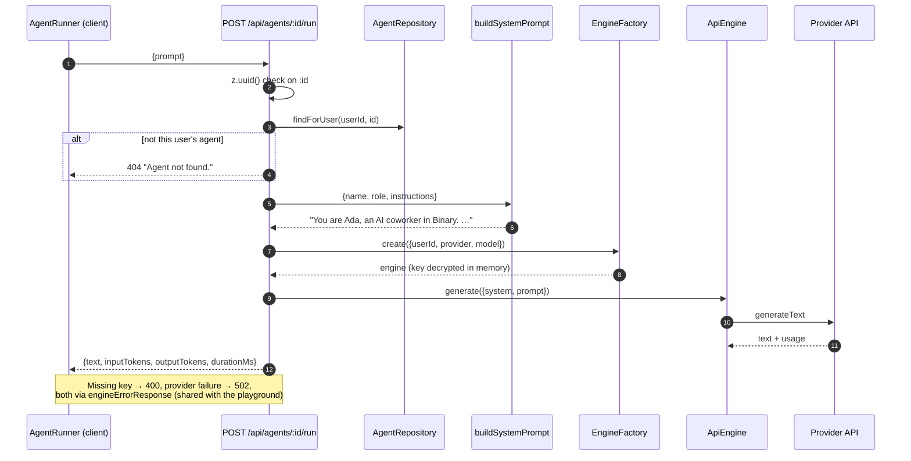

# Request flow: hiring and running an agent

## Hiring from a template

```mermaid
sequenceDiagram
  autonumber
  actor U as User
  participant P as /agents/new?template=research-assistant<br/>(server page)
  participant F as AgentForm (client)
  participant R as POST /api/agents
  participant K as ProviderKeyRepository
  participant T as AgentTemplateRepository
  participant A as AgentRepository

  U->>P: Click "Research Assistant"
  P->>P: getFromApi keys + templates<br/>(no keys → redirect /settings)
  P-->>F: template pre-fills name, role, instructions
  U->>F: Change the name, pick a model, "Hire agent"
  F->>F: agentInputSchema.safeParse
  F->>R: {name, role, instructions, provider, model, templateId}
  R->>K: find(userId, provider)
  alt no key
    R-->>F: 400 "Add your … API key in Settings first."
  end
  R->>T: findById(templateId)
  alt unknown template
    R-->>F: 400 "That template does not exist."
  end
  R->>A: create({...fields, userId, templateId})
  R-->>F: 201 {agent}
  F->>F: router.push(/agents/:id)
```

## Giving an agent a task

```mermaid
sequenceDiagram
  autonumber
  participant C as AgentRunner (client)
  participant R as POST /api/agents/:id/run
  participant A as AgentRepository
  participant S as buildSystemPrompt
  participant F as EngineFactory
  participant E as ApiEngine
  participant AI as Provider API

  C->>R: {prompt}
  R->>R: z.uuid() check on :id
  R->>A: findForUser(userId, id)
  alt not this user's agent
    R-->>C: 404 "Agent not found."
  end
  R->>S: {name, role, instructions}
  S-->>R: "You are Ada, an AI coworker in Binary. …"
  R->>F: create({userId, provider, model})
  F-->>R: engine (key decrypted in memory)
  R->>E: generate({system, prompt})
  E->>AI: generateText
  AI-->>E: text + usage
  R-->>C: {text, inputTokens, outputTokens, durationMs}
  Note over R,C: Missing key → 400, provider failure → 502,<br/>both via engineErrorResponse (shared with the playground)
```
