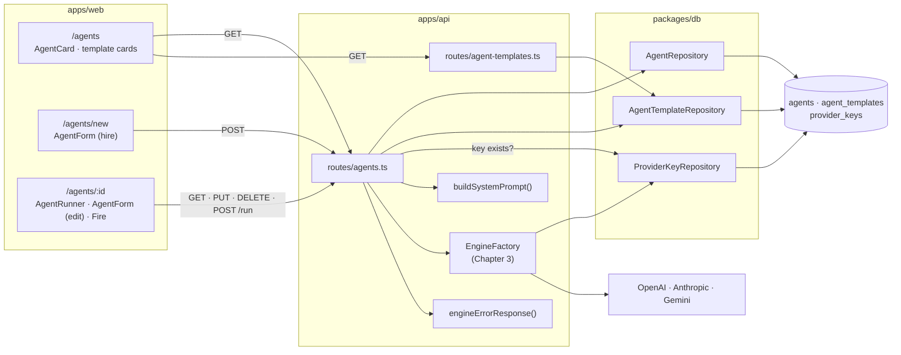
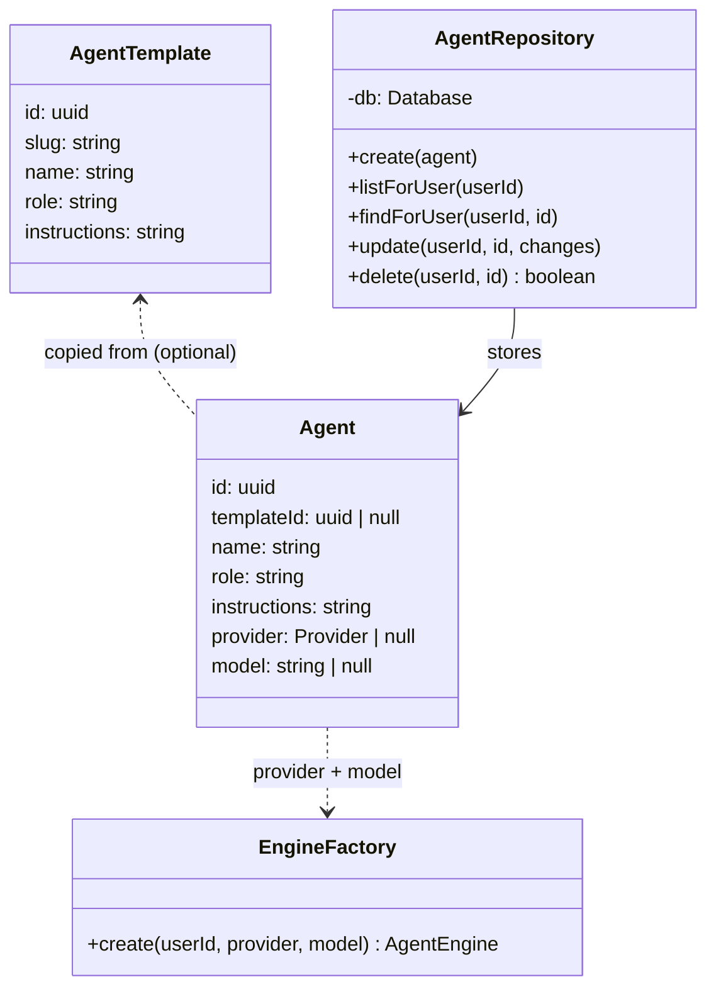

# System overview: Chapter 4

## Components

```mermaid
flowchart LR
  subgraph web["apps/web"]
    LIST["/agents<br/>AgentCard · template cards"]
    NEW["/agents/new<br/>AgentForm (hire)"]
    ONE["/agents/:id<br/>AgentRunner · AgentForm (edit) · Fire"]
  end

  subgraph api["apps/api"]
    RA["routes/agents.ts"]
    RT["routes/agent-templates.ts"]
    SP["buildSystemPrompt()"]
    EE["engineErrorResponse()"]
    EF["EngineFactory<br/>(Chapter 3)"]
  end

  subgraph db["packages/db"]
    AR["AgentRepository"]
    TR["AgentTemplateRepository"]
    PKR["ProviderKeyRepository"]
  end

  PROV["OpenAI · Anthropic · Gemini"]
  PG[("agents · agent_templates<br/>provider_keys")]

  LIST -- "GET" --> RA
  LIST -- "GET" --> RT
  NEW -- "POST" --> RA
  ONE -- "GET · PUT · DELETE · POST /run" --> RA
  RA --> AR
  RA --> TR
  RA -- "key exists?" --> PKR
  RA --> SP
  RA --> EF
  RA --> EE
  RT --> TR
  EF --> PKR
  EF --> PROV
  AR & TR & PKR --> PG
```

## What an agent is made of

```mermaid
classDiagram
  class Agent {
    id: uuid
    templateId: uuid | null
    name: string
    role: string
    instructions: string
    provider: Provider | null
    model: string | null
  }
  class AgentTemplate {
    id: uuid
    slug: string
    name: string
    role: string
    instructions: string
  }
  class AgentRepository {
    -db: Database
    +create(agent)
    +listForUser(userId)
    +findForUser(userId, id)
    +update(userId, id, changes)
    +delete(userId, id) boolean
  }
  class EngineFactory {
    +create(userId, provider, model) AgentEngine
  }
  AgentTemplate <.. Agent : copied from (optional)
  AgentRepository --> Agent : stores
  Agent ..> EngineFactory : provider + model
```

A template is copied into the form once. After hiring, the agent and the
template are independent.
