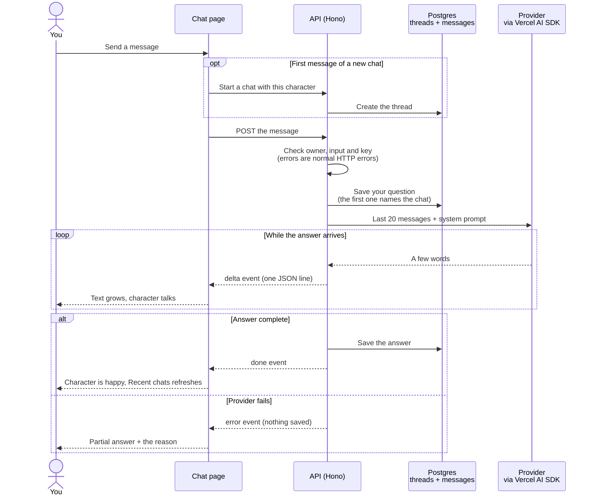

# Chapter 5 diagram

What happens when you send a message: every check runs before the stream
starts, and the answer is only saved once it's complete.

```mermaid
sequenceDiagram
  actor You
  participant Web as Chat page
  participant API as API (Hono)
  participant DB as Postgres<br/>threads + messages
  participant LLM as Provider<br/>via Vercel AI SDK

  You->>Web: Send a message
  opt First message of a new chat
    Web->>API: Start a chat with this character
    API->>DB: Create the thread
  end
  Web->>API: POST the message
  API->>API: Check owner, input and key<br/>(errors are normal HTTP errors)
  API->>DB: Save your question<br/>(the first one names the chat)
  API->>LLM: Last 20 messages + system prompt
  loop While the answer arrives
    LLM-->>API: A few words
    API-->>Web: delta event (one JSON line)
    Web-->>You: Text grows, character talks
  end
  alt Answer complete
    API->>DB: Save the answer
    API-->>Web: done event
    Web-->>You: Character is happy, Recent chats refreshes
  else Provider fails
    API-->>Web: error event (nothing saved)
    Web-->>You: Partial answer + the reason
  end
```
