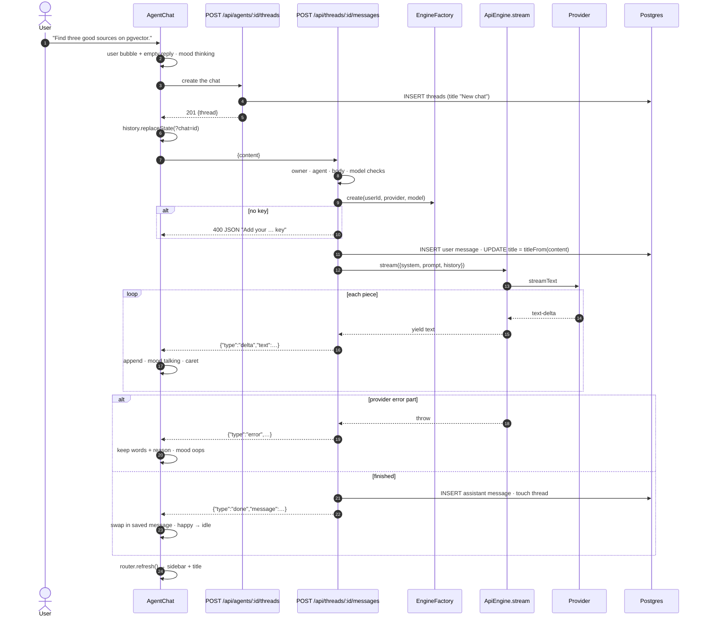

# Request flow: the first message of a new chat

```mermaid
sequenceDiagram
  autonumber
  actor U as User
  participant C as AgentChat
  participant A as POST /api/agents/:id/threads
  participant M as POST /api/threads/:id/messages
  participant F as EngineFactory
  participant E as ApiEngine.stream
  participant AI as Provider
  participant DB as Postgres

  U->>C: "Find three good sources on pgvector."
  C->>C: user bubble + empty reply · mood thinking
  C->>A: create the chat
  A->>DB: INSERT threads (title "New chat")
  A-->>C: 201 {thread}
  C->>C: history.replaceState(?chat=id)
  C->>M: {content}
  M->>M: owner · agent · body · model checks
  M->>F: create(userId, provider, model)
  alt no key
    M-->>C: 400 JSON "Add your … key"
  end
  M->>DB: INSERT user message · UPDATE title = titleFrom(content)
  M->>E: stream({system, prompt, history})
  E->>AI: streamText
  loop each piece
    AI-->>E: text-delta
    E-->>M: yield text
    M-->>C: {"type":"delta","text":…}
    C->>C: append · mood talking · caret
  end
  alt provider error part
    E-->>M: throw
    M-->>C: {"type":"error",…}
    C->>C: keep words + reason · mood oops
  else finished
    M->>DB: INSERT assistant message · touch thread
    M-->>C: {"type":"done","message":…}
    C->>C: swap in saved message · happy → idle
  end
  C->>C: router.refresh() → sidebar + title
```

Later messages skip steps 3–6: the chat already exists, and the history
(last 20 messages) goes to the model.
