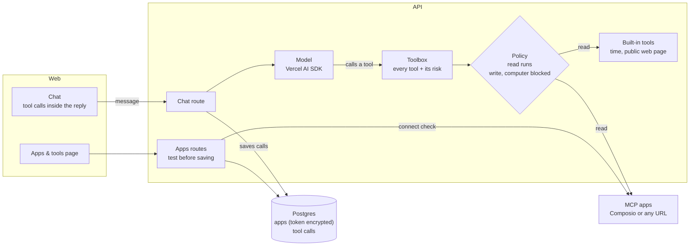

# Chapter 6 diagram

Every tool, built-in or from an app, goes through one toolbox, and a policy
checks its risk level before it runs. In this chapter only `read` passes.

```mermaid
flowchart LR
  subgraph Web
    C["Chat<br/>tool calls inside the reply"]
    P["Apps & tools page"]
  end

  subgraph API
    R["Chat route"]
    AR["Apps routes<br/>test before saving"]
    MO["Model<br/>Vercel AI SDK"]
    TB["Toolbox<br/>every tool + its risk"]
    PO{"Policy<br/>read runs<br/>write, computer blocked"}
    BI["Built-in tools<br/>time, public web page"]
  end

  APP["MCP apps<br/>Composio or any URL"]
  DB[("Postgres<br/>apps (token encrypted)<br/>tool calls")]

  C -- "message" --> R --> MO
  MO -- "calls a tool" --> TB --> PO
  PO -- "read" --> BI
  PO -- "read" --> APP
  R -- "saves calls" --> DB
  P --> AR -- "connect check" --> APP
  AR --> DB
```
