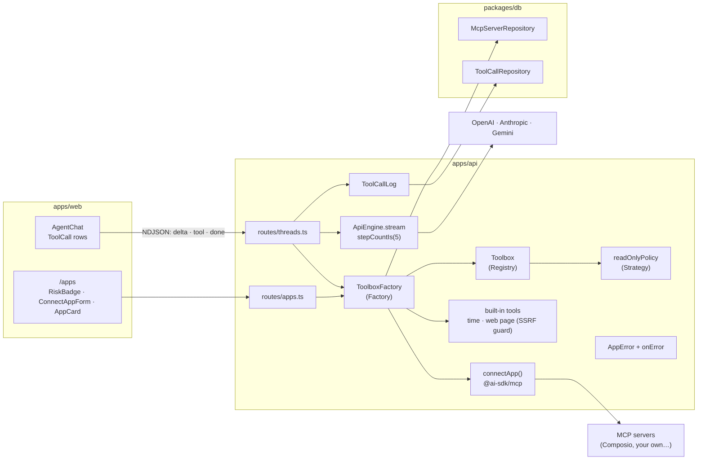
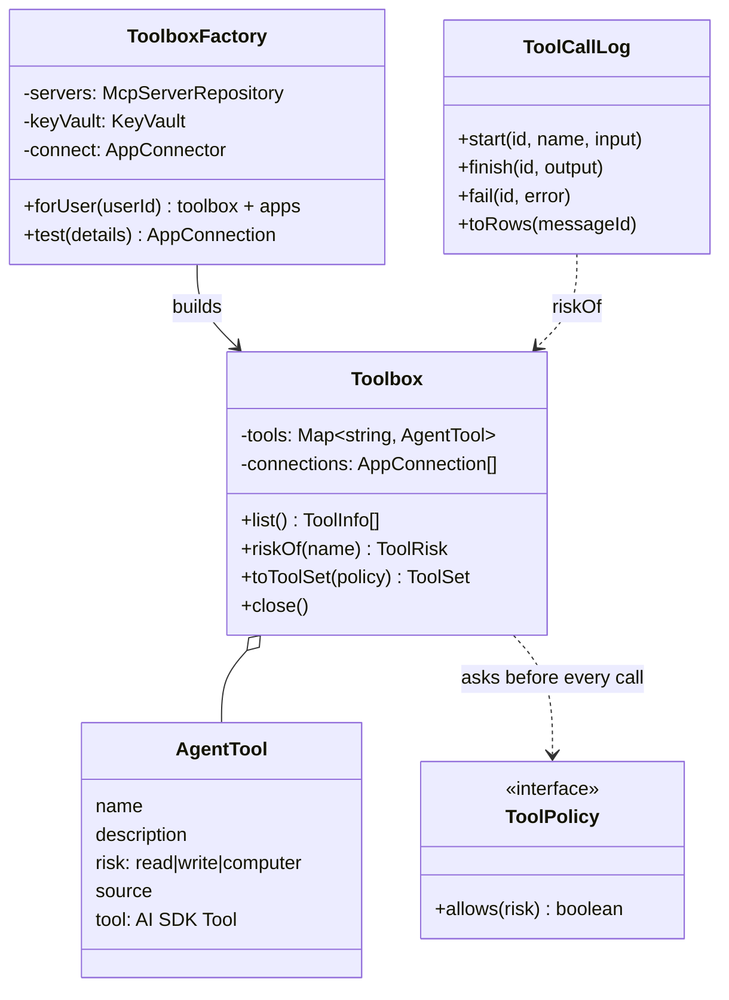

# System overview: Chapter 6

## Components

```mermaid
flowchart LR
  subgraph web["apps/web"]
    AP["/apps<br/>RiskBadge · ConnectAppForm · AppCard"]
    CH["AgentChat<br/>ToolCall rows"]
  end

  subgraph api["apps/api"]
    RAPP["routes/apps.ts"]
    RTH["routes/threads.ts"]
    TF["ToolboxFactory<br/>(Factory)"]
    TB["Toolbox<br/>(Registry)"]
    POL["readOnlyPolicy<br/>(Strategy)"]
    BI["built-in tools<br/>time · web page (SSRF guard)"]
    MCP["connectApp()<br/>@ai-sdk/mcp"]
    LOG["ToolCallLog"]
    ENG["ApiEngine.stream<br/>stepCountIs(5)"]
    ERR["AppError + onError"]
  end

  subgraph db["packages/db"]
    MSR["McpServerRepository"]
    TCR["ToolCallRepository"]
  end

  APPS["MCP servers<br/>(Composio, your own…)"]
  PROV["OpenAI · Anthropic · Gemini"]

  AP --> RAPP
  CH -- "NDJSON: delta · tool · done" --> RTH
  RAPP & RTH --> TF
  TF --> MSR
  TF --> BI
  TF --> MCP --> APPS
  TF --> TB
  TB --> POL
  RTH --> ENG --> PROV
  RTH --> LOG --> TCR
```

## Classes and their patterns

```mermaid
classDiagram
  class AgentTool {
    name
    description
    risk: read|write|computer
    source
    tool: AI SDK Tool
  }
  class ToolPolicy {
    <<interface>>
    +allows(risk) boolean
  }
  class Toolbox {
    -tools: Map~string, AgentTool~
    -connections: AppConnection[]
    +list() ToolInfo[]
    +riskOf(name) ToolRisk
    +toToolSet(policy) ToolSet
    +close()
  }
  class ToolboxFactory {
    -servers: McpServerRepository
    -keyVault: KeyVault
    -connect: AppConnector
    +forUser(userId) toolbox + apps
    +test(details) AppConnection
  }
  class ToolCallLog {
    +start(id, name, input)
    +finish(id, output)
    +fail(id, error)
    +toRows(messageId)
  }
  ToolboxFactory --> Toolbox : builds
  Toolbox o-- AgentTool
  Toolbox ..> ToolPolicy : asks before every call
  ToolCallLog ..> Toolbox : riskOf
```
