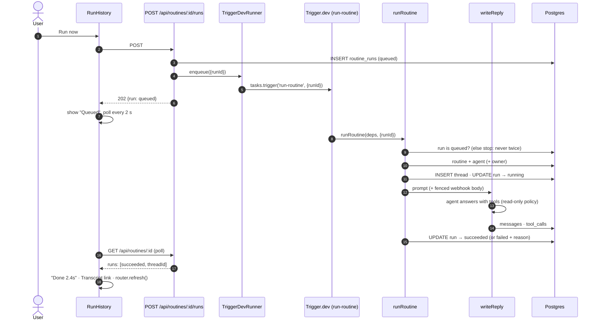

# Request flow: one run, end to end

"Run now" with Trigger.dev connected. Without it, step 4 calls `runRoutine`
inside the API instead.

```mermaid
sequenceDiagram
  autonumber
  actor U as User
  participant W as RunHistory
  participant R as POST /api/routines/:id/runs
  participant J as TriggerDevRunner
  participant T as Trigger.dev (run-routine)
  participant RR as runRoutine
  participant WR as writeReply
  participant DB as Postgres

  U->>W: Run now
  W->>R: POST
  R->>DB: INSERT routine_runs (queued)
  R->>J: enqueue({runId})
  J->>T: tasks.trigger('run-routine', {runId})
  R-->>W: 202 {run: queued}
  W->>W: show "Queued", poll every 2 s
  T->>RR: runRoutine(deps, {runId})
  RR->>DB: run is queued? (else stop: never twice)
  RR->>DB: routine + agent (+ owner)
  RR->>DB: INSERT thread · UPDATE run → running
  RR->>WR: prompt (+ fenced webhook body)
  WR->>WR: agent answers with tools (read-only policy)
  WR->>DB: messages · tool_calls
  RR->>DB: UPDATE run → succeeded (or failed + reason)
  W->>R: GET /api/routines/:id (poll)
  R-->>W: runs: [succeeded, threadId]
  W->>W: "Done 2.4s" · Transcript link · router.refresh()
```
