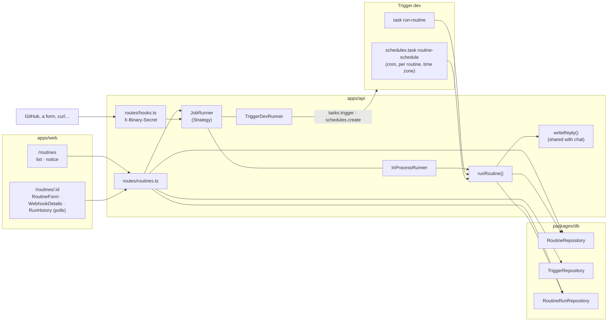
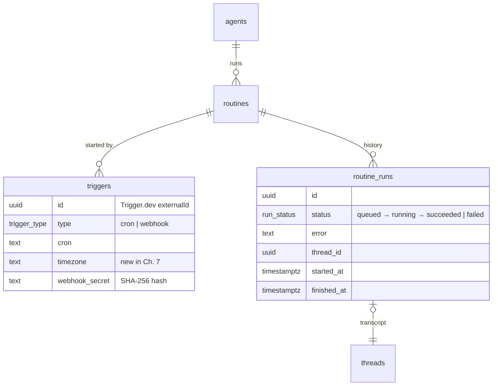

# System overview: Chapter 7

## Components

```mermaid
flowchart LR
  subgraph web["apps/web"]
    RL["/routines<br/>list · notice"]
    RD["/routines/:id<br/>RoutineForm · WebhookDetails · RunHistory (polls)"]
  end

  EXT["GitHub, a form, curl…"]

  subgraph api["apps/api"]
    RR["routes/routines.ts"]
    HK["routes/hooks.ts<br/>X-Binary-Secret"]
    JR["JobRunner<br/>(Strategy)"]
    IP["InProcessRunner"]
    TD["TriggerDevRunner"]
    RUN["runRoutine()"]
    WR["writeReply()<br/>(shared with chat)"]
  end

  subgraph trig["Trigger.dev"]
    T1["task run-routine"]
    T2["schedules.task routine-schedule<br/>(cron, per routine, time zone)"]
  end

  subgraph db["packages/db"]
    RO["RoutineRepository"]
    TR["TriggerRepository"]
    RN["RoutineRunRepository"]
  end

  RL & RD --> RR
  EXT --> HK
  RR & HK --> JR
  JR --- IP & TD
  IP --> RUN
  TD -- "tasks.trigger · schedules.create" --> trig
  T1 & T2 --> RUN
  RUN --> WR
  RR --> RO & TR & RN
  RUN --> RO & RN
```

## Data

```mermaid
erDiagram
  agents ||--o{ routines : runs
  routines ||--o{ triggers : "started by"
  routines ||--o{ routine_runs : history
  routine_runs |o--|| threads : transcript

  triggers {
    uuid id "Trigger.dev externalId"
    trigger_type type "cron | webhook"
    text cron
    text timezone "new in Ch. 7"
    text webhook_secret "SHA-256 hash"
  }
  routine_runs {
    uuid id
    run_status status "queued → running → succeeded | failed"
    text error
    uuid thread_id
    timestamptz started_at
    timestamptz finished_at
  }
```
