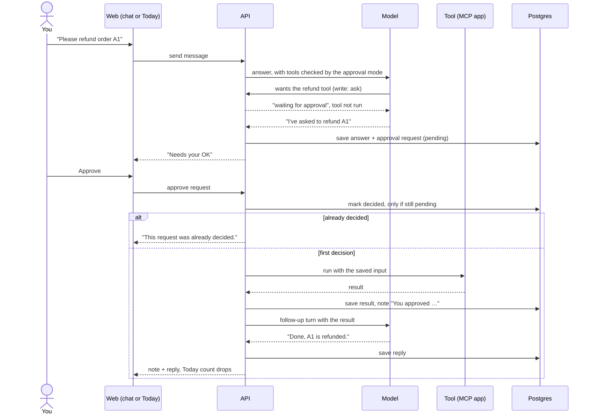

# Chapter 8 diagram

Follow one request from asking to approving. The first half ends as soon as
the request is saved; the second half starts whenever you click Approve,
seconds or days later.

```mermaid
sequenceDiagram
  actor U as You
  participant W as Web (chat or Today)
  participant A as API
  participant M as Model
  participant T as Tool (MCP app)
  participant D as Postgres

  U->>W: "Please refund order A1"
  W->>A: send message
  A->>M: answer, with tools checked by the approval mode
  M->>A: wants the refund tool (write: ask)
  A-->>M: "waiting for approval", tool not run
  M-->>A: "I've asked to refund A1"
  A->>D: save answer + approval request (pending)
  A-->>W: "Needs your OK"

  U->>W: Approve
  W->>A: approve request
  A->>D: mark decided, only if still pending
  alt already decided
    A-->>W: "This request was already decided."
  else first decision
    A->>T: run with the saved input
    T-->>A: result
    A->>D: save result, note "You approved …"
    A->>M: follow-up turn with the result
    M-->>A: "Done, A1 is refunded."
    A->>D: save reply
    A-->>W: note + reply, Today count drops
  end
```
