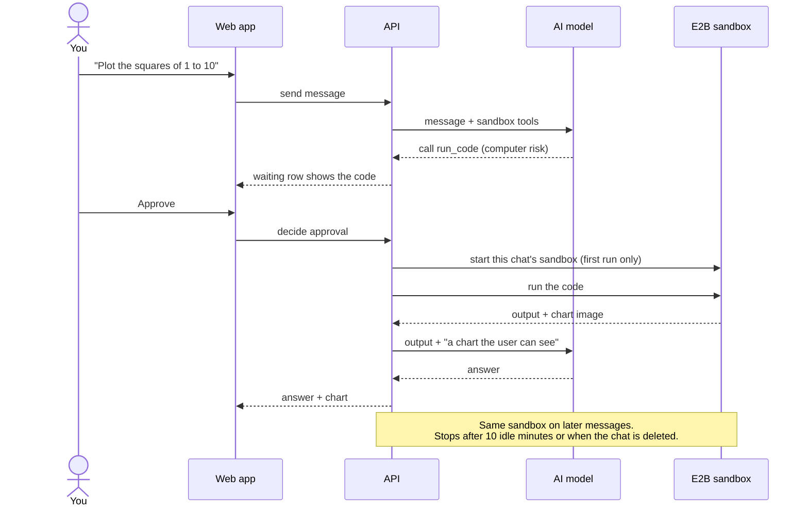

# Chapter 9 diagram

What happens when a character wants to run code: it asks first, and the
chat's sandbox only starts once you approve.

```mermaid
sequenceDiagram
  actor You
  participant Web as Web app
  participant API as API
  participant Model as AI model
  participant E2B as E2B sandbox

  You->>Web: "Plot the squares of 1 to 10"
  Web->>API: send message
  API->>Model: message + sandbox tools
  Model-->>API: call run_code (computer risk)
  API-->>Web: waiting row shows the code
  You->>Web: Approve
  Web->>API: decide approval
  API->>E2B: start this chat's sandbox (first run only)
  API->>E2B: run the code
  E2B-->>API: output + chart image
  API->>Model: output + "a chart the user can see"
  Model-->>API: answer
  API-->>Web: answer + chart
  Note over API,E2B: Same sandbox on later messages.<br/>Stops after 10 idle minutes or when the chat is deleted.
```
