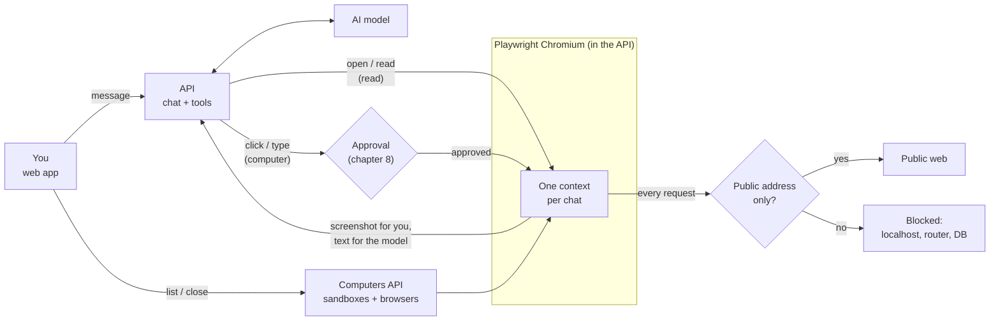

# Chapter 10 diagram

Reads go straight to the browser, clicks and typing go through approval
first, and every request the browser makes passes the public-address check.

```mermaid
flowchart LR
  U["You<br/>web app"]
  API["API<br/>chat + tools"]
  M["AI model"]
  AP{"Approval<br/>(chapter 8)"}

  subgraph Browser["Playwright Chromium (in the API)"]
    C["One context<br/>per chat"]
  end

  G{"Public address<br/>only?"}
  WEB["Public web"]
  NO["Blocked:<br/>localhost, router, DB"]
  CP["Computers API<br/>sandboxes + browsers"]

  U -- "message" --> API
  API <--> M
  API -- "open / read<br/>(read)" --> C
  API -- "click / type<br/>(computer)" --> AP
  AP -- "approved" --> C
  C -- "every request" --> G
  G -- "yes" --> WEB
  G -- "no" --> NO
  C -- "screenshot for you,<br/>text for the model" --> API
  U -- "list / close" --> CP
  CP --> C
```
