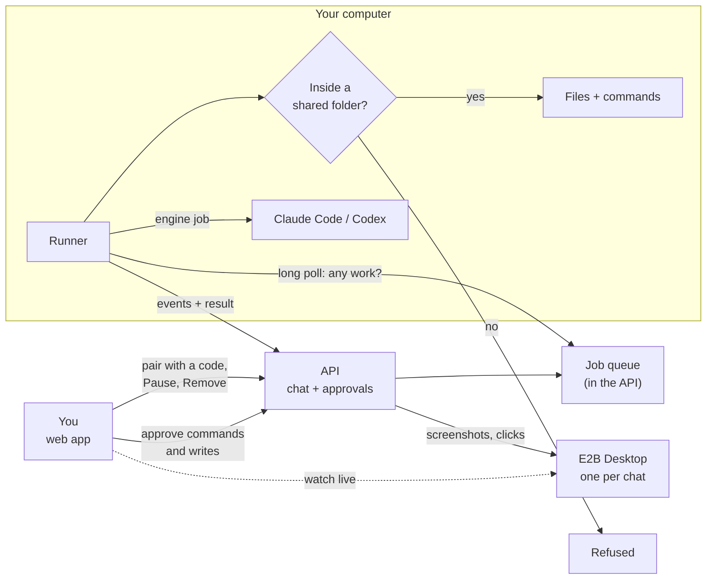

# Chapter 11 diagram

The Runner on your computer asks the API for work; the API never connects
to it. The folder check happens on your side.

```mermaid
flowchart LR
  U["You<br/>web app"]
  API["API<br/>chat + approvals"]
  HUB["Job queue<br/>(in the API)"]
  D["E2B Desktop<br/>one per chat"]

  subgraph PC["Your computer"]
    R["Runner"]
    F{"Inside a<br/>shared folder?"}
    J["Files + commands"]
    CLI["Claude Code / Codex"]
  end

  U -- "pair with a code,<br/>Pause, Remove" --> API
  U -- "approve commands<br/>and writes" --> API
  API --> HUB
  R -- "long poll: any work?" --> HUB
  R -- "events + result" --> API
  R --> F
  F -- "yes" --> J
  F -- "no" --> X["Refused"]
  R -- "engine job" --> CLI
  API -- "screenshots, clicks" --> D
  U -. "watch live" .-> D
```
