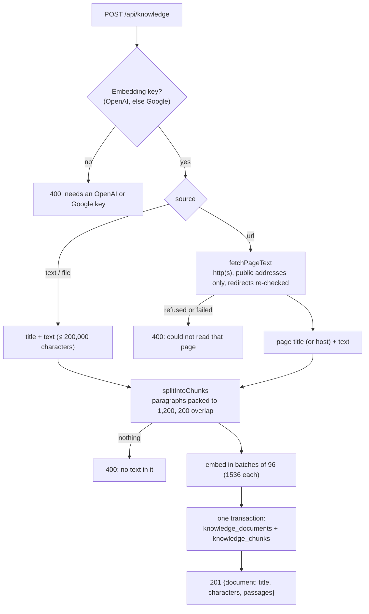
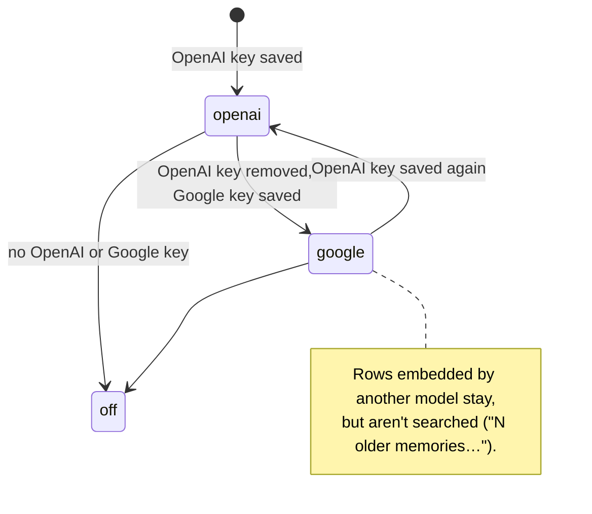

# Adding a document

```mermaid
flowchart TD
  IN["POST /api/knowledge"] --> K{"Embedding key?<br/>(OpenAI, else Google)"}
  K -- no --> E1["400: needs an OpenAI or Google key"]
  K -- yes --> S{"source"}
  S -- text / file --> T["title + text (≤ 200,000 characters)"]
  S -- url --> F["fetchPageText<br/>http(s), public addresses only, redirects re-checked"]
  F -- refused or failed --> E2["400: could not read that page"]
  F --> T2["page title (or host) + text"]
  T & T2 --> C["splitIntoChunks<br/>paragraphs packed to 1,200, 200 overlap"]
  C -- nothing --> E3["400: no text in it"]
  C --> EM["embed in batches of 96 (1536 each)"]
  EM --> TX["one transaction:<br/>knowledge_documents + knowledge_chunks"]
  TX --> OK["201 {document: title, characters, passages}"]
```

## Switching keys

```mermaid
stateDiagram-v2
  [*] --> openai: OpenAI key saved
  openai --> google: OpenAI key removed, Google key saved
  google --> openai: OpenAI key saved again
  openai --> off: no OpenAI or Google key
  google --> off
  note right of google
    Rows embedded by another model stay,
    but aren't searched ("N older memories…").
  end note
```
