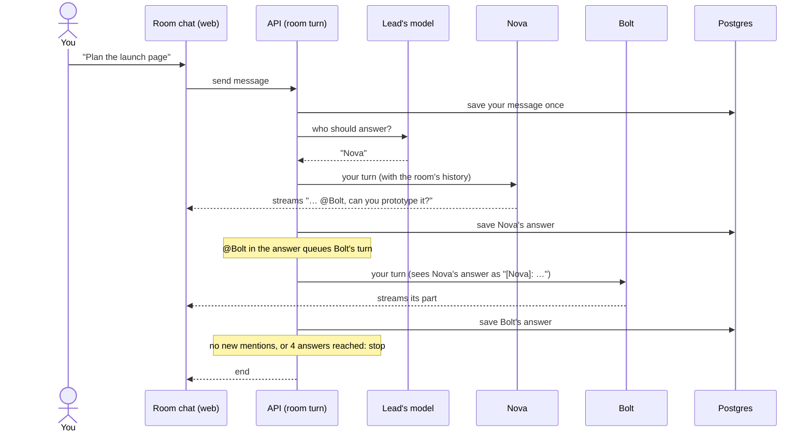

# Chapter 13 diagram

One message in an Automatic room. Follow the turns: the lead picks who
starts, each answer can hand over with an @mention, and the room stops at 4
answers.

```mermaid
sequenceDiagram
  actor You
  participant Room as Room chat (web)
  participant API as API (room turn)
  participant Lead as Lead's model
  participant Nova
  participant Bolt
  participant DB as Postgres

  You->>Room: "Plan the launch page"
  Room->>API: send message
  API->>DB: save your message once
  API->>Lead: who should answer?
  Lead-->>API: "Nova"
  API->>Nova: your turn (with the room's history)
  Nova-->>Room: streams "… @Bolt, can you prototype it?"
  API->>DB: save Nova's answer
  Note over API: @Bolt in the answer queues Bolt's turn
  API->>Bolt: your turn (sees Nova's answer as "[Nova]: …")
  Bolt-->>Room: streams its part
  API->>DB: save Bolt's answer
  Note over API: no new mentions, or 4 answers reached: stop
  API-->>Room: end
```
