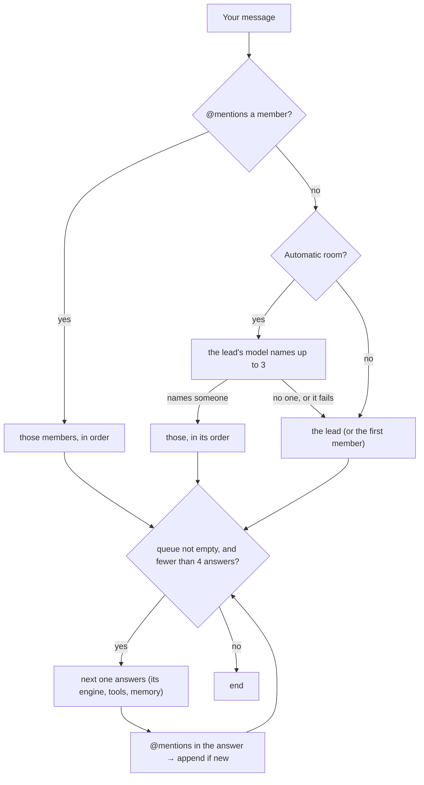

# Who answers

```mermaid
flowchart TD
  M["Your message"] --> Q1{"@mentions a member?"}
  Q1 -- yes --> MEN["those members, in order"]
  Q1 -- no --> Q2{"Automatic room?"}
  Q2 -- yes --> RL["the lead's model names up to 3"]
  RL -- names someone --> PICK["those, in its order"]
  RL -- no one, or it fails --> LEAD
  Q2 -- no --> LEAD["the lead (or the first member)"]
  MEN & PICK & LEAD --> LOOP{"queue not empty, and fewer than 4 answers?"}
  LOOP -- yes --> ANS["next one answers (its engine, tools, memory)"]
  ANS --> HO["@mentions in the answer → append if new"]
  HO --> LOOP
  LOOP -- no --> END["end"]
```
