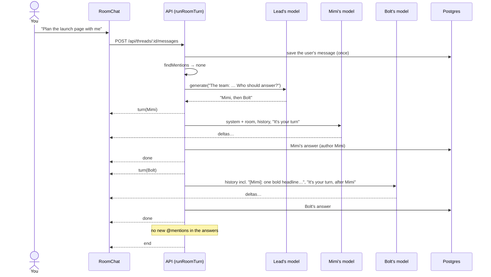

# Request flow: a message in an automatic room

```mermaid
sequenceDiagram
  actor U as You
  participant W as RoomChat
  participant A as API (runRoomTurn)
  participant L as Lead's model
  participant Mi as Mimi's model
  participant B as Bolt's model
  participant DB as Postgres

  U->>W: "Plan the launch page with me"
  W->>A: POST /api/threads/:id/messages
  A->>DB: save the user's message (once)
  A->>A: findMentions → none
  A->>L: generate("The team: … Who should answer?")
  L-->>A: "Mimi, then Bolt"
  A-->>W: turn(Mimi)
  A->>Mi: system + room, history, "It's your turn"
  Mi-->>W: deltas…
  A->>DB: Mimi's answer (author Mimi)
  A-->>W: done
  A-->>W: turn(Bolt)
  A->>B: history incl. "[Mimi]: one bold headline…", "It's your turn, after Mimi"
  B-->>W: deltas…
  A->>DB: Bolt's answer
  A-->>W: done
  Note over A: no new @mentions in the answers
  A-->>W: end
```

A hand-off works the same way: if an answer says "@Bolt, can you…", Bolt
joins the queue and answers next, while the room is still under 4 answers.
