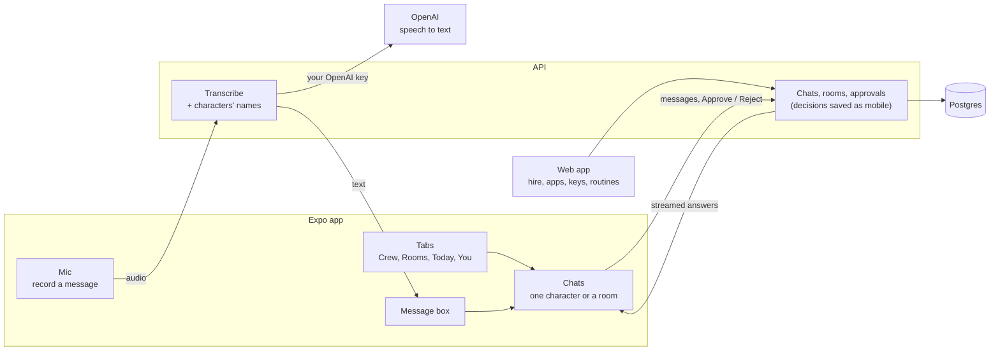

# Chapter 14 diagram

The phone talks only to the API, which holds every key. Look at the voice
path: audio goes up, text comes back into the message box.

```mermaid
flowchart LR
  subgraph Phone["Expo app"]
    TABS["Tabs<br/>Crew, Rooms, Today, You"]
    CHAT["Chats<br/>one character or a room"]
    MIC["Mic<br/>record a message"]
    BOX["Message box"]
  end

  WEB["Web app<br/>hire, apps, keys, routines"]

  subgraph API["API"]
    ROUTES["Chats, rooms, approvals<br/>(decisions saved as mobile)"]
    VOICE["Transcribe<br/>+ characters' names"]
  end

  OAI["OpenAI<br/>speech to text"]
  DB[("Postgres")]

  TABS --> CHAT
  CHAT -- "messages, Approve / Reject" --> ROUTES
  ROUTES -- "streamed answers" --> CHAT
  MIC -- "audio" --> VOICE
  VOICE -- "your OpenAI key" --> OAI
  VOICE -- "text" --> BOX --> CHAT
  ROUTES --> DB
  WEB --> ROUTES
```
