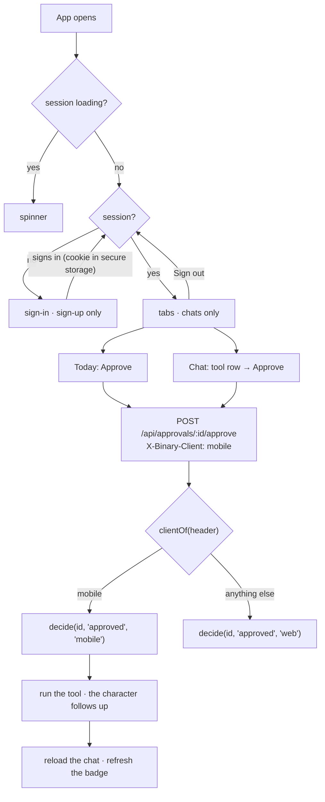

# Signed in or out, and an approval from the phone

```mermaid
flowchart TD
  O["App opens"] --> P{"session loading?"}
  P -- yes --> SP["spinner"]
  P -- no --> S{"session?"}
  S -- no --> IN["sign-in · sign-up only"]
  IN -- "signs in (cookie in secure storage)" --> S
  S -- yes --> TABS["tabs · chats only"]
  TABS -- "Sign out" --> S

  TABS --> TODAY["Today: Approve"]
  TABS --> CHAT["Chat: tool row → Approve"]
  TODAY & CHAT --> REQ["POST /api/approvals/:id/approve<br/>X-Binary-Client: mobile"]
  REQ --> CL{"clientOf(header)"}
  CL -- mobile --> SAVE["decide(id, 'approved', 'mobile')"]
  CL -- "anything else" --> WEB["decide(id, 'approved', 'web')"]
  SAVE --> RUN["run the tool · the character follows up"]
  RUN --> BADGE["reload the chat · refresh the badge"]
```
