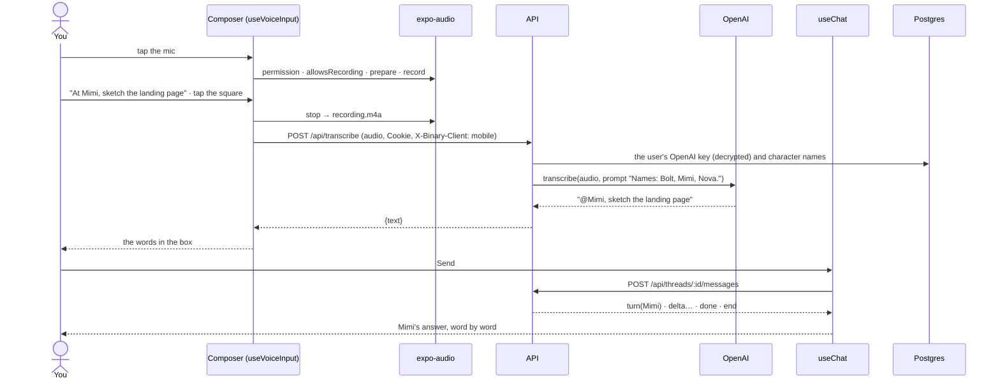

# Request flow: a spoken message

```mermaid
sequenceDiagram
  actor U as You
  participant C as Composer (useVoiceInput)
  participant R as expo-audio
  participant A as API
  participant O as OpenAI
  participant Ch as useChat
  participant DB as Postgres

  U->>C: tap the mic
  C->>R: permission · allowsRecording · prepare · record
  U->>C: "At Mimi, sketch the landing page" · tap the square
  C->>R: stop → recording.m4a
  C->>A: POST /api/transcribe (audio, Cookie, X-Binary-Client: mobile)
  A->>DB: the user's OpenAI key (decrypted) and character names
  A->>O: transcribe(audio, prompt "Names: Bolt, Mimi, Nova.")
  O-->>A: "@Mimi, sketch the landing page"
  A-->>C: {text}
  C-->>U: the words in the box
  U->>Ch: Send
  Ch->>A: POST /api/threads/:id/messages
  A-->>Ch: turn(Mimi) · delta… · done · end
  Ch-->>U: Mimi's answer, word by word
```

Nothing is saved until you send: transcribing only returns text.
