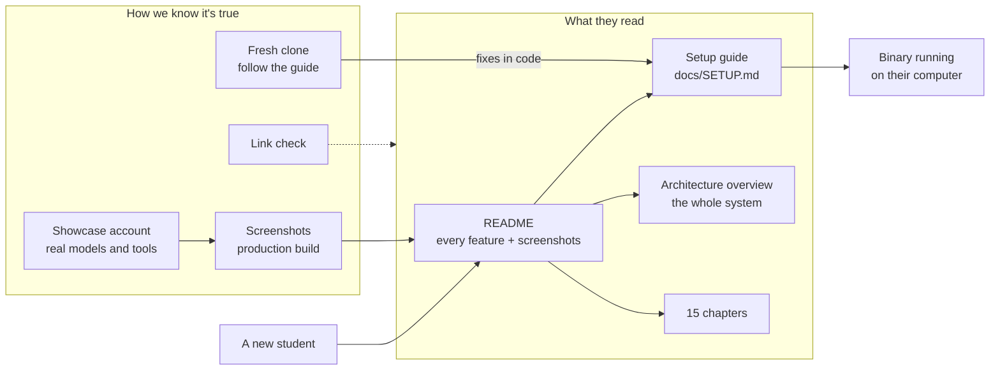

# Chapter 15 diagram

The path a newcomer takes through the docs, and the checks that keep it
honest. The screenshots come from real runs; the guide is proven on a fresh
clone.

```mermaid
flowchart LR
  N["A new student"]

  subgraph Docs["What they read"]
    R["README<br/>every feature + screenshots"]
    S["Setup guide<br/>docs/SETUP.md"]
    A["Architecture overview<br/>the whole system"]
    C["15 chapters"]
  end

  subgraph Proof["How we know it's true"]
    SA["Showcase account<br/>real models and tools"]
    SH["Screenshots<br/>production build"]
    FC["Fresh clone<br/>follow the guide"]
    LC["Link check"]
  end

  B["Binary running<br/>on their computer"]

  N --> R --> S --> B
  R --> A
  R --> C
  SA --> SH --> R
  FC -- "fixes in code" --> S
  LC -.-> Docs
```
